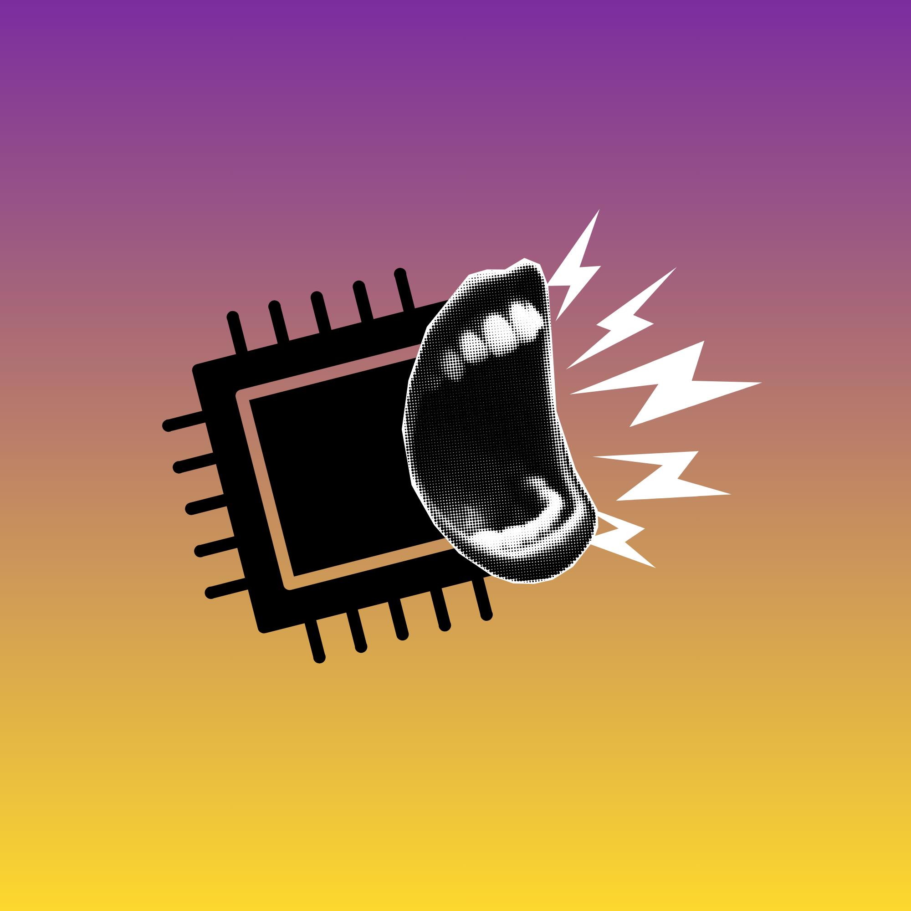
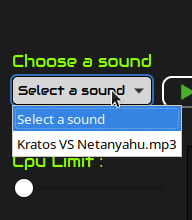
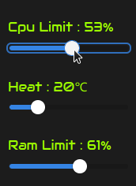
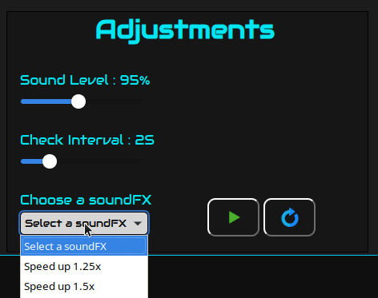
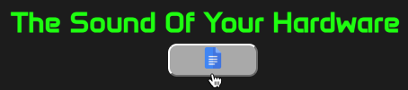
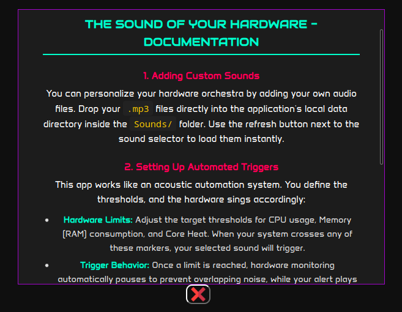

# TheSoundOfYourHardware 0.1.0 FULL
[](https://www.rust-lang.org/)
[](https://tauri.app/)
[](https://www.typescriptlang.org/)




## What is TheSoundOfYourHardware?

When your selected limits are reached (cpu, memory usage and general heat) your hardware hacks your computers sound system and runs whatever you selected sound and selected soundfx.

## How is it works?

When you are pressing play button in adjustments div, that starts to watching your hardware and when your one of selected limits are reach the app adds some soundfx into your selected sound then plays it.

## Lets scream your hardware!

## Installation for ubuntu

first be sure your webkit is up-to-date

```bash
sudo apt update && sudo apt install -y \
  libnotify4 \
  libnotify-bin \
  libnotify-dev \
  notification-daemon \
  dbus-x11 \
  d-feet \
  gir1.2-notify-0.7 \
  libwebkit2gtk-4.1-dev \
  libappindicator3-1 \
  libappindicator3-dev \
  librsvg2-common \
  libasound2-dev \
  libglib2.0-dev \
  libgtk-3-dev \
  xdg-desktop-portal \
  xdg-desktop-portal-gtk \
  zenity
```

then install trigox using .deb file
```bash
sudo apt install ./thesoundofyourhardware_*_amd64.deb
```

now you can run it like:
```bash
thesoundofyourhardware
```

## Where should i put sounds?
/home/USERNAME/.local/share/com.kuzeyc.thesoundofyourhardware/Sounds/

If you can't see sounds please restart app.

| STEP | Usage |
| --- |  ---  |
| 1) Choosing sound | |
| 2) Configuring limits   | |
| 3) Adjustments | |
| 4) Checking doc page | |
| 5) Doc reading | |

## Used TECHS
| Tech | Where |
| --- |  ---  |
| Vanilla CSS, HTML, TS | Frontend and talking with rust side |
| Tauri | Bridge between states, frontend and backend |
| Rust | Watching hardware, playing sound and adding soundfx, managing sound path|


## Tested distros

| Distro | Desc |
| --- |  ---  |
| CachyOS | I just got CachyOS so i just tried in CachyOS |
| Ubuntu 24 lts | Live boot btw, it worked but except notification system. |

**Note: old versions of ubuntu like before 2023 it might be not work on your distro cause of glibc version. Please test it in latest or new distros.**

## Used AIs

| LLM | Usage |
| --- |  ---  |
| Gemini | For Researchs and code fixes |


## Note for reviewer
If you are thinking about isn't similiar to <href>https://github.com/CSDC-K/Trigox no it isn't. You can't add soundfx to sound and can't watch hardware.
